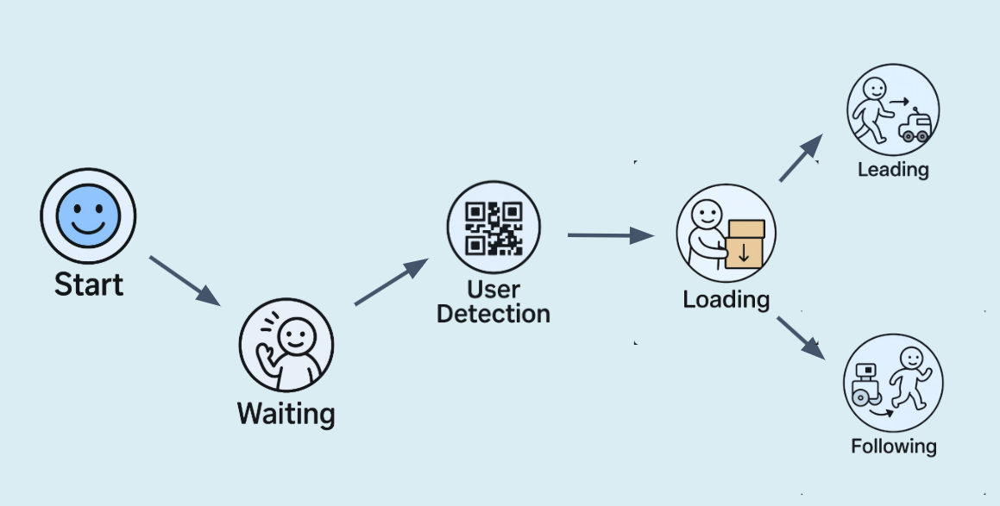
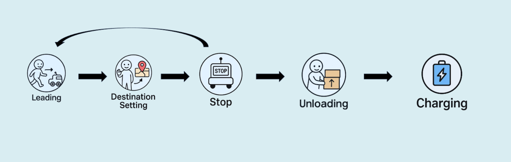
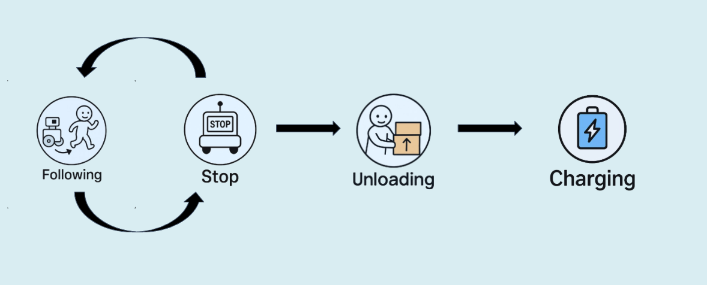
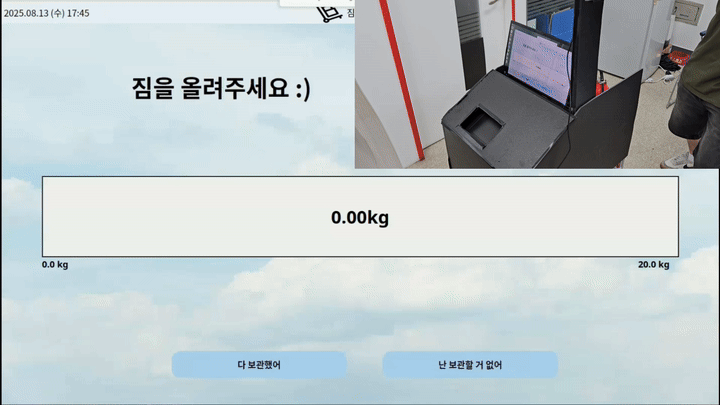
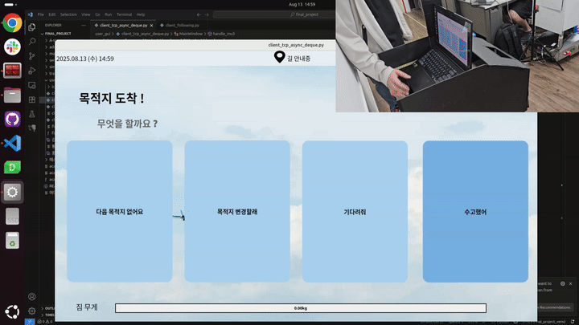
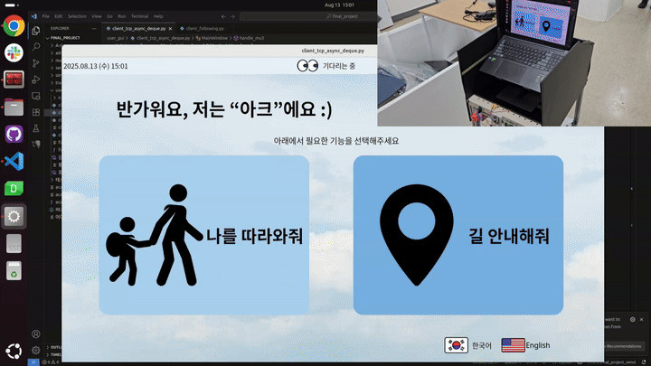
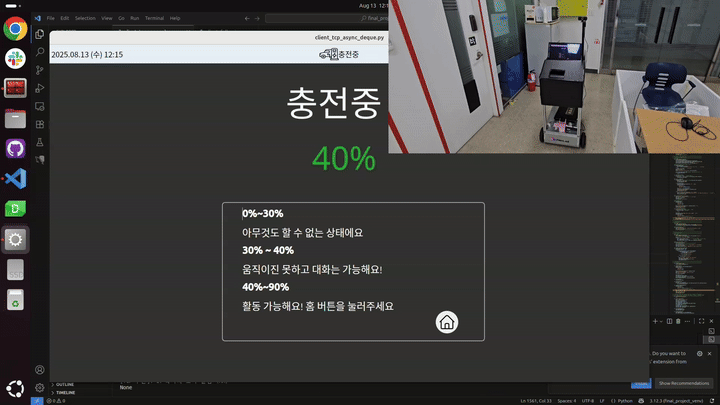

# 🛫 ARCS: Airport Robot for Customer Service
A robot system specialized for airports that provides **Leading/Following guidance** and **natural language Q&A (LLM)**.

---

## 🎥 Quick Demos
> Core functions of Leading / Following. **Click the thumbnails to play.**

| Leading (Guidance) | Following (Tracking) |
| --- | --- |
|  |  

---
## 0. Development Environment
| Category           | Technology |
|----------------|-----------|
| **Development Environment** |   |
| **Language**           |  |
| **Database**   |  |
| **Version Control**      |   |
| **Collaboration Tools**      |    |
| **ROS/Simulation** |  |

---
## 1. Overview
**ARCS** is a robot system that safely **guides airport passengers to their destinations**, provides **natural language Q&A**, and includes **operation/management tools**.

---

## 2. Key Features
| Area | Core |
|---|---|
| **Guidance** | Leading/Following, multiple waypoints, detour & re-entry handling |
| **Safety** | Front/rear/left/right hazard avoidance, E-Stop |
| **Recognition** | Tracking + embedding-based Re-ID for consistent target |
| **Operation** | User GUI / Admin Console separation |
| **Knowledge Q&A** | Lightweight LLM + LoRA, separated from navigation control |

---

## 3. Team Information
| Name | Role | Responsibilities |
|---|---|---|
| **Jineon Kim** | Team Lead | Tracking, Main Service, Data Service |
| **Donghun Lee** | Member | Chat Service (LLM), Admin GUI, DB, SLAM/Mapping |
| **Dongyeon Lee** | Member | User GUI, Communication Interfaces, Testing |
| **Younghun Yoo** | Member | Main Controller navigation, SLAM/Mapping |

---

## 4. Design

### 4.1. User Requirements
| Stakeholder | Requirement | Priority |
|---|---|---|
| USER | Destination **Leading** guidance | HIGH |
| USER | **Baggage loading/transport** | HIGH |
| USER | **Follow without drifting away** | HIGH |
| USER | Minimize disturbance | MEDIUM |
| USER | **Answer questions appropriately** | MEDIUM |
| ADMIN | **Auto-return policy** after use | HIGH |
| ADMIN | **Robot status monitoring** | HIGH |
| ADMIN | **User information lookup** | MEDIUM |
| ADMIN | **Return to charging station** on low battery | HIGH |

### 4.2. System Requirements

#### 4.2.1 Navigation
| ID | NAME | DESCRIPTION | STATUS |
|---|---|---|---|
| SR_1 | Obstacle Handling | Detects static/dynamic obstacles and avoids or stops | ✅ |
| SR_2 | Map Generation | Generates an environment map | ✅ |
| SR_3 | Multiple Waypoints | Allows multi-stop destinations | ✅ |
| SR_4 | Path Planning | Generates route from place/position input | ✅ |
| SR_5 | Path Following | Moves to destination along optimal route | ✅ |

#### 4.2.2 Deep Learning
| ID | NAME | DESCRIPTION | STATUS |
|---|---|---|---|
| SR_6 | Distance Maintenance | Keeps user–robot distance within **1.5 m** | ✅ |
| SR_7 | Distance Check | Measures user–robot distance in real time | ✅ |
| SR_8 | User Tracking | Follows user within **0.8–1.2 m** | ✅ |
| SR_9 | Voice Commands | Simple voice control (“Take me to my gate”) | ✅ |
| SR_10 | Q&A | Responds to domain-specific queries (shops, locations, flights) | ✅ |
| SR_11 | Multilingual Support | Korean/English/Chinese etc. | ❌ |

#### 4.2.3 Notification/Alerts
| ID | NAME | DESCRIPTION | STATUS |
|---|---|---|---|
| SR_12 | Warning Alerts | Voice alerts on distance loss/re-entry (Following/Leading messages) | ✅ |
| SR_13 | Error Alerts | Alerts on network/path error, battery < 20% | ❌ |
| SR_14 | Informational Alerts | Battery/progress, load, remaining distance/time, arrival | ✅ |

#### 4.2.4 Information Management
| ID | NAME | DESCRIPTION | STATUS |
|---|---|---|---|
| SR_15 | User Registration | Save user info via boarding pass QR | ✅ |
| SR_16 | Robot State Logging | Save robot state periodically | ✅ |
| SR_17 | User Info Lookup | Retrieve past user info (auth required) | ✅ |
| SR_18 | Real-time Robot Monitoring | Map-based visualization of position, battery, status | ✅ |
| SR_19 | Analytics | Visit frequency, demographics visualization | ❌ |

#### 4.2.5 Additional Features
| ID | NAME | DESCRIPTION | STATUS |
|---|---|---|---|
| SR_20 | Secure Baggage Storage | Lock/unlock with password | ❌ |
| SR_21 | Weight Measurement | Measure total loaded weight | ✅ |
| SR_22 | Auto Return | (1) Return after user ends session (2) Return after idle at destination | ✅ |

### 4.3. System Architecture

### 4.4. Interface Specification (Summary)
- **Common Frame**: Header 0x00 · Length 4B · Command 2B

**4.4.1 User GUI → Main Service → Main Controller (TCP)**  
| Command | Description |
|---|---|
| **CK** | Path request |
| **FW / LD** | Start **Following / Leading** |
| **PS** | **Pause** |
| **RT** | **Return to charging station** after task |
| **ED** | **Modify path** |
| **KG** | Request **loadcell sensor values** |

**4.4.2 Main Controller → Main Service → User GUI (TCP)**  
| Command | Description |
|---|---|
| **AR** | Notify **arrival at destination/waypoint** |
| **MV** | Send **robot status data** |

**4.4.3 Admin GUI ↔ Main Service (TCP)**  
| Command | Description |
|---|---|
| **LG** | **Admin login** |
| **RL** | Request/response for **real-time robot state** |
| **UI** | **User info lookup** |

> Detailed payloads/error codes/sequence diagrams are recommended to be managed under `/docs/interface/*`.

### 4.5. Data Structure (Entity Overview)
| Table | Purpose | Key Columns (example) |
|---|---|---|
| PLACE_TYPE | Destination types (restaurant/shop/service) | id, name |
| PLACE | POI metadata/visitor statistics | id, type_id, name, visitor, total, pos_x, pos_y |
| PRODUCTS | Store inventory | id, name, price, place_id |
| TASK_TYPE | Robot task types | id, name |
| ADMIN | Admin accounts | id, username, password(hash) |
| USER | User info | id, name, ticket, boarding, departure, gate, sex, age, seat, from, to, robot_id, created |
| ARCS_1 | Real-time robot state | id, user, task, leading, loading, pos_x, pos_y, status_time |
| ROUTE | Route records (waypoints) | id, robot_id, pos_x, pos_y |
| ROBOT_LIST | Registered robots | id |

### 4.6. State Diagram
> After common flow, diverges into **Leading / Following**.
#### Common
  
*Start → Waiting → User Detection → Loading*
#### Leading
  
*Leading → Destination Setting ↔ Stop → Unloading → Charging*
#### Following
  
*Following ↔ Stop → Unloading → Charging*

### 4.7. GUI Configuration

#### 4.7.1 Stepbar (User Flow)
- **Leading (6 steps)**: `Setup → Destination & Plan → Lead → Pause/Resume → Finish → Charging`  
- **Following (5 steps)**: `Setup → Follow → Pause/Resume → Finish → Charging`

##### 4.7.1.A Leading
| Step | Description | Clip |
|---|---|---|
| **1) Setup** | - **ARCS_mode** — *Select Mode (Leading/Following)* - **ARCS_qr** — *QR Authentication* - **ARCS_load** — *Baggage loading check* |    |
| **2) Destination & Plan** | - **ARCS_destinations** — *Select destination/waypoints* - **ARCS_path** — *Path generated* |   |
| **3) Lead** | - **ARCS_lead** — *Main leading demo* - **ARCS_next** — *Next waypoint reached* - **ARCS_leave_comeback** — *User leaves/returns* |    |
| **4) Pause / Resume** | - **ARCS_pause_resume** — *Pause/Resume* |  |
| **5) Finish** | - **ARCS_end** — *End session (arrival/unloading)* - **ARCS_return** — *Return to base after finish* |   |
| **6) Charging** | - **ARCS_charge** — *Dock and begin charging* |  |

##### 4.7.1.B Following
| Step | Description | Clip |
|---|---|---|
| **1) Setup** | - **ARCS_mode** — *Select Mode (Leading/Following)* - **ARCS_qr** — *QR Authentication* - **ARCS_load** — *Baggage loading check* |    |
| **2) Follow** | - **ARCS_follow** — *Main following demo* - **ARCS_far_close** — *Target lost/distance exceeded* - **ARCS_avoid** — *Obstacle avoidance* |    |
| **3) Pause / Resume** | - **ARCS_pause_resume** — *Pause/Resume* |  |
| **4) Finish** | - **ARCS_end** — *End session (arrival/unloading)* - **ARCS_return** — *Return to base after finish* |   |
| **5) Charging** | - **ARCS_charge** — *Dock and begin charging* |  |

---

## 5. Intelligent Modules

### 5.1. Tracking & Re-ID
- Pipeline: **Human detection → Multi-object tracking → Embedding-based Re-ID (similarity)**  
- Effect: Maintains **consistent ID on re-entry**, reduces misidentification in crowds  

**Troubleshooting (Summary)**

| Issue | Attempted Solution | Result/Decision |
|---|---|---|
| ID change on frame out/re-entry | DeepSORT only, raised `max_age` | Confirmed **Re-ID necessary** |
| Backbone speed vs accuracy | ResNet34 → **ResNet18** | **Real-time achieved**, stable ID |

### 5.2. Following Obstacle Avoidance
- Defines **hazard zones** (front/rear/left/right), executes avoidance maneuvers  
  

### 5.3. LLM Service
- **Base**: google/gemma-2b, **Fine-tuning**: LoRA (peft), Adapter: `adapter_model.safetensors`  
- **I/O(JSON)**: `{ "prompt": "...", "response": "..." }`  
- **Safety**: Separate process from navigation, keyword filtering, response length limit  

---

## 6. Troubleshooting

### 6.1. Cross-Subnet Communication (Static Routing)
- **Problem**: Direct communication between different subnets (192.168.0.x ↔ 192.168.5.x) failed  
- **Solution**: Used Raspberry Pi (**192.168.0.23 / 192.168.5.1**) as **router**

**Network Summary**  
| Node | Interface | IP/Prefix | Notes |
|---|---|---|---|
| Laptop A | eth0 | **192.168.0.145/24** | 0.x subnet |
| Laptop B | wlan0/eth0 | **192.168.5.9/24** | 5.x subnet |
| Raspberry Pi | eth0 | **192.168.0.23/24** | gateway for 0.x |
| Raspberry Pi | wlan0 | **192.168.5.1/24** | gateway for 5.x |

**Routing Setup**  
| Step | Node | Purpose | Command |
|---|---|---|---|
| 1 | Raspberry Pi | Enable IP forwarding | `sudo sysctl -w net.ipv4.ip_forward=1` |
| 2 | Laptop A (0.145) | Add route to 5.x | `sudo ip route add 192.168.5.0/24 via 192.168.0.23` |
| 3 | Laptop B (5.9) | Add route to 0.x | `sudo ip route add 192.168.0.0/24 via 192.168.5.1` |

**Validation**  
| Check | Command | Expected Result |
|---|---|---|
| Route A→B | `ip route get 192.168.5.9` | next hop 192.168.0.23 |
| Route B→A | `ip route get 192.168.0.145` | next hop 192.168.5.1 |
| Trace | `traceroute -n <IP>` | Pi IP shows as 1 hop |

**Final Commands (Summary)**  
- A (0.145): `sudo ip route add 192.168.5.0/24 via 192.168.0.23`  
- B (5.9): `sudo ip route add 192.168.0.0/24 via 192.168.5.1`

### 6.2. Nav2 Path Extraction (Costmap)
- **Issue**: `getPathThroughPoses(start, goals)` failed with *state 6*, though `GoToPose` worked  
- **Cause**: Leftover **global/local costmap inflation bubbles** blocked path  
- **Solution**: Clear costmap before planning → wait 200–500ms → replan  

**Services**  
| Purpose | Service | Type | Example |
|---|---|---|---|
| Clear Global | `/global_costmap/clear_entirely_global_costmap` | `nav2_msgs/srv/ClearEntireCostmap` | `ros2 service call /global_costmap/clear_entirely_global_costmap nav2_msgs/srv/ClearEntireCostmap {}` |
| Clear Local | `/local_costmap/clear_entirely_local_costmap` | `nav2_msgs/srv/ClearEntireCostmap` | `ros2 service call /local_costmap/clear_entirely_local_costmap nav2_msgs/srv/ClearEntireCostmap {}` |

---

## 7. Limitations
- Dense crowds can reduce tracking performance → needs enhanced Re-ID/prediction  
- LLM may hallucinate or omit answers without domain knowledge → requires knowledge injection and dataset expansion  
- Network instability may delay GUI–robot sync → needs heartbeat/retransmission/buffering  

---

## 8. Conclusion & Future Works

**Conclusion**: Leading/Following, stable tracking, safe navigation assistance, and separated Admin/User operation have been integrated into a system with **practical on-site value**.

**Future Works**
1. **Performance Metrics**: Publish and improve P50/P95 latency, re-ID consistency, avoidance success rate, stopping distance  
2. **LLM Enhancement**: Expand domain knowledge and reinforce safety (keyword filtering, instruction filtering)  
3. **Deployment**: Long-term real-world operation in airports with accumulated data
